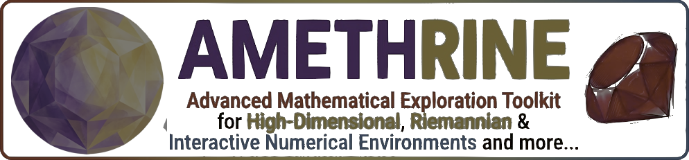
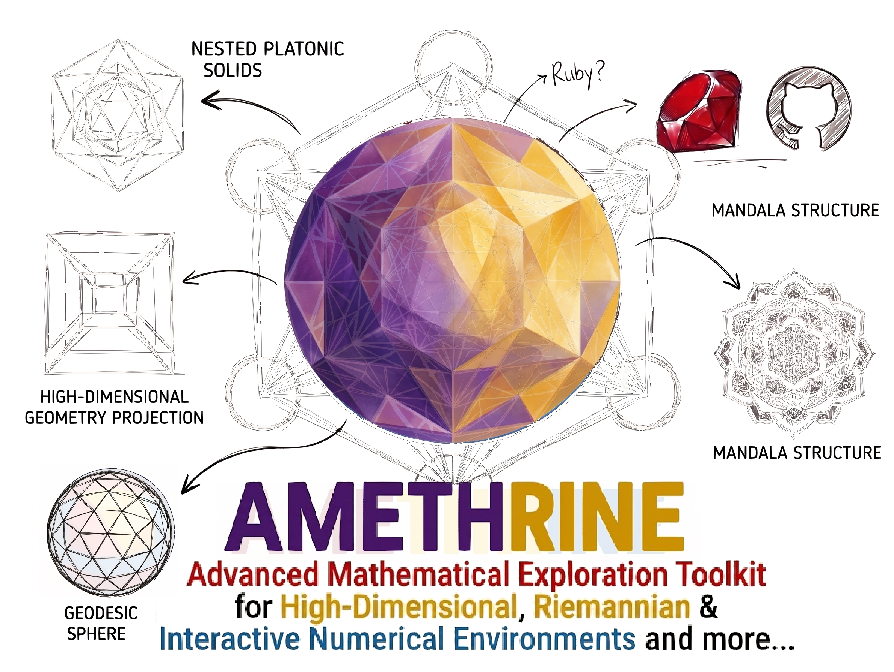

<h1 align="center">AMETHRINE</h1>

<p align="center">
  <strong>A</strong>dvanced <strong>M</strong>athematical <strong>E</strong>xploration <strong>T</strong>oolkit for
  <strong>H</strong>igh-dimensional, <strong>R</strong>iemannian &amp;
  <strong>I</strong>nteractive <strong>N</strong>umerical <strong>E</strong>nvironments
</p>

<p align="center">
  <em>Interactive visualization of complex numbers, probability distributions,<br>
  Hilbert spaces, intersections, and non-Euclidean geometry — in Ruby.</em>
</p>

> **Status: active development, not yet released.** The mathematics is
> implemented and tested; the rendering layer is being built out.

The logo is an **ideal hyperbolic triangle** in the Poincaré disk. Its three
sides are geodesics — circular arcs meeting the boundary at right angles —
drawn in red, yellow and blue. They meet only at infinity, which is a fair
picture of what this library is about: straight lines that are not straight,
and intersections that behave differently depending on the space you are in.
The arc geometry in `assets/` was computed by
`Amethrine::Geometry::Hyperbolic.ideal_geodesic_circle`, not drawn by hand.


---

---

## Why

Ruby has no library for exploring advanced mathematical structure
interactively. Chartkick and Gruff cover dashboards; Charty reaches for
matplotlib through a Python subprocess, which defeats the point of a native
stack. Nothing covers complex analysis, Hilbert spaces, or the difference
between Euclidean and non-Euclidean geometry.

AMETHRINE fills that gap, and does it without building a rendering engine:
Vega-Lite (via the `vega` gem) for 2D, Three.js for 3D. Ruby's job is to get
the mathematics right and emit correct scene data.

## Modules

| Module | Covers | State |
|---|---|---|
| `Hilbert` | Inner products, Gram matrices, modified Gram–Schmidt, orthogonal projection, Parseval defect | ✅ tested |
| `Intersect` | Line–line (2D/3D, incl. skew), line–plane, ray–sphere, plane–plane, plane–sphere | ✅ tested |
| `Geometry` | Euclidean, spherical and hyperbolic models behind one interface; angle sums, geodesics, parallels | ✅ tested |
| `ArgandDiagram` | Complex plane, moduli, roots of complex numbers | ✅ tested |
| `DistributionPlot` | Normal, exponential, Poisson densities and PMFs | ✅ tested |
| `ManifoldPlot` | Sphere, Poincaré disk and Poincaré ball | ✅ tested |
| `Scene3D` | Three.js scene emission, twisted-ribbon meshes | ✅ tested |
| `LinkedView` | Linked embedding + per-group statistics | ✅ tested |

**47 automated checks pass** across the suite, on Ruby's bundled Minitest —
no gem installation needed to verify.

## Install

```ruby
# Gemfile
gem "amethrine", github: "YOURNAME/amethrine"
```

The core emits plain Hashes and has **no runtime dependencies**. The `vega`
gem is only needed by the caller to render a spec; Three.js loads client-side.

## Quick start

```ruby
require "amethrine"

# --- Hilbert space: project, then check what the basis missed ---
basis = Amethrine::Hilbert.gram_schmidt([[1.0,1.0,0.0],[1.0,0.0,1.0]])
v     = [3.0, -2.0, 5.0]
Amethrine::Hilbert.project(v, basis)
Amethrine::Hilbert.parseval_defect(v, basis)   # 0 iff the basis spans v

# --- intersections: the picking primitive ---
Amethrine::Intersect.line_sphere([0,0,-5.0], [0,0,1.0], [0,0,0.0], 1.0)
#=> {type: :two_points, points: [[0,0,-1.0], [0,0,1.0]], t: [4.0, 6.0]}

# 3D lines usually miss each other; you get the near-miss, not a nil
Amethrine::Intersect.line_line_3d([0,0,0.0],[1,0,0.0], [0,0,1.0],[0,1,0.0])
#=> {type: :skew, distance: 1.0, closest_1: ..., closest_2: ...}

# --- cross-section a sphere with a plane ---
Amethrine::Intersect.plane_sphere([0,0,1.0], 0.6, [0,0,0.0], 1.0)
#=> {type: :circle, center: [0,0,0.6], radius: 0.8, normal: [0,0,1.0]}

# --- the parallel postulate, made computable ---
Amethrine::Geometry::Euclidean.parallels_through_point   #=> 1
Amethrine::Geometry::Spherical.parallels_through_point   #=> 0
Amethrine::Geometry::Hyperbolic.parallels_through_point  #=> Infinity

# curvature you can measure: the octant's angle sum is exactly 3*pi/2
o = Amethrine::Geometry::Spherical
o.angle_sum([1,0,0.0],[0,1,0.0],[0,0,1.0])   #=> 4.712... (3*pi/2)
o.area([1,0,0.0],[0,1,0.0],[0,0,1.0])        #=> 1.570... (pi/2 = 4*pi/8)
```

## The idea holding it together

Three geometries differ in exactly one axiom, and that difference shows up as
**how things intersect**:

| | Parallels through a point | Triangle angle sum | Two "lines" |
|---|---|---|---|
| Euclidean | exactly one | $= \pi$ | meet in at most one point |
| Spherical | none | $> \pi$ (excess **is** the area) | **always** meet, in an antipodal pair |
| Hyperbolic | infinitely many | $< \pi$ (defect **is** the area) | may never meet |

Orthogonal projection in `Hilbert` is the same idea algebraically: the
projection of a vector onto a subspace is where the perpendicular through it
meets that subspace. Intersections are the connective tissue between the
modules, not a separate topic.

## Testing

```bash
ruby test/test_new_modules.rb    # Hilbert, Intersect, Geometry
ruby test/test_amethrine.rb      # complex, distributions, manifolds, 3D
```

Both run on Ruby's bundled Minitest. The geometry tests check against exact
analytic values — Girard's theorem for the spherical octant, orthogonality of
Poincaré geodesics to the disk boundary — rather than eyeballing plots.

## Acknowledgements and inspiration

**[PerMetrics](https://github.com/thieu1995/permetrics)** (Nguyen Van Thieu,
[JOSS 2024](https://doi.org/10.21105/joss.06143)) is the design model here,
not a dependency. Its philosophy — comprehensive coverage of one clearly
bounded domain, a stateless API, and a deliberately minimal dependency
footprint (NumPy and SciPy only, for 112 metrics) — is what AMETHRINE aims to
do for mathematical visualization in Ruby.

**No PerMetrics code is used or derived from.** PerMetrics is GPL-3 and
AMETHRINE is MIT; the debt is architectural, and citing it is the honest way
to record that.

```bibtex
@article{Thieu_PerMetrics_2024,
  author  = {Thieu, Nguyen Van},
  title   = {PerMetrics: A Framework of Performance Metrics for Machine Learning Models},
  journal = {Journal of Open Source Software},
  doi     = {10.21105/joss.06143},
  year    = {2024}
}
```

Also standing on: the [`vega`](https://github.com/ankane/vega) gem
(Andrew Kane) for Vega-Lite bindings, [Three.js](https://threejs.org) for
WebGL, and [GR.rb](https://github.com/red-data-tools/GR.rb) (Red Data Tools)
for publication-quality static export.

## License

MIT. See [LICENSE](LICENSE).
